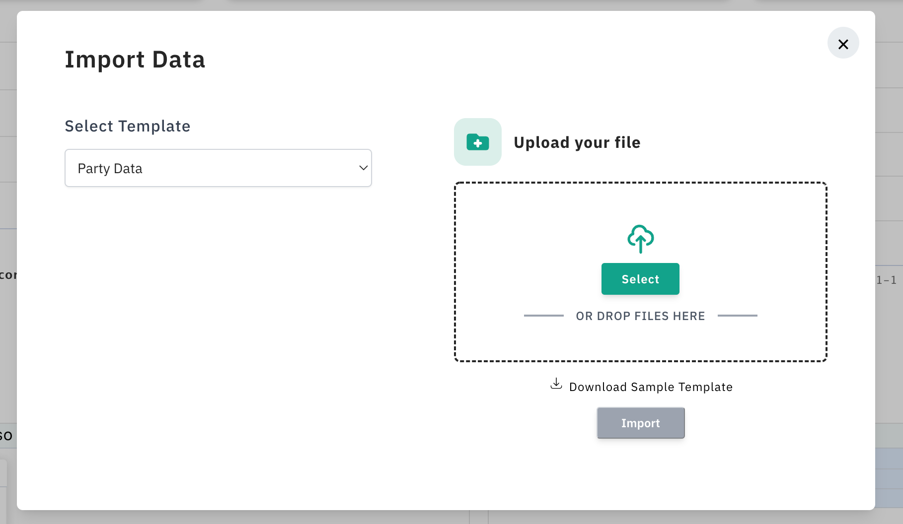

\# Data Import Widget


  


 It provides user side of part for already generated templates and allow user to import data into their database system. for more info please visit [Data Import](https://github.com/knovator/data-import) or contact us via email.

Use case,

To use widget you must have created project in [Data Import](https://github.com/knovator/data-import) and also there should be atleast one template to get started,

```jsx
import DataImport from '@knovator/data-import-widget'

function App() {
  
  return (<div>
    	<DataImport >
      	<button> Import data </button>
      </DataImport>
    </div>)
}
```

DataImport listens to click event on it's children and based on that it will open modal for importing files, 




Here it will load templates from your provided project. Once you choose a template it will show the option to upload the file(.xlsx, .csv). After uploading a file via the Import button, the Import Data modal will be closed. In the background, it will do validation and transformation based on columns of the selected template. After all that, it will call the callback URL from the template with extracted data.

Loading thousands of data at one time is not good for the server, it'll unnecessarily use CPU  and Memory. To reduce such kind of accident it will split data into chunks of 1000 and then it will call a callback API .

| Props               | Required ? | Type       | Use Case                                                     |
| ------------------- | ---------- | ---------- | ------------------------------------------------------------ |
| `onNotify`          | false      | `function` | `{type: 'success' | 'error',payload: success message or error stack}` |
| `getAdditionalInfo` | false      | `function` | it can be used if you need to pass addition data to the proccess file |
| `projectCode`       | true       | `string`   | You need to pass your project code to load templates.        |

